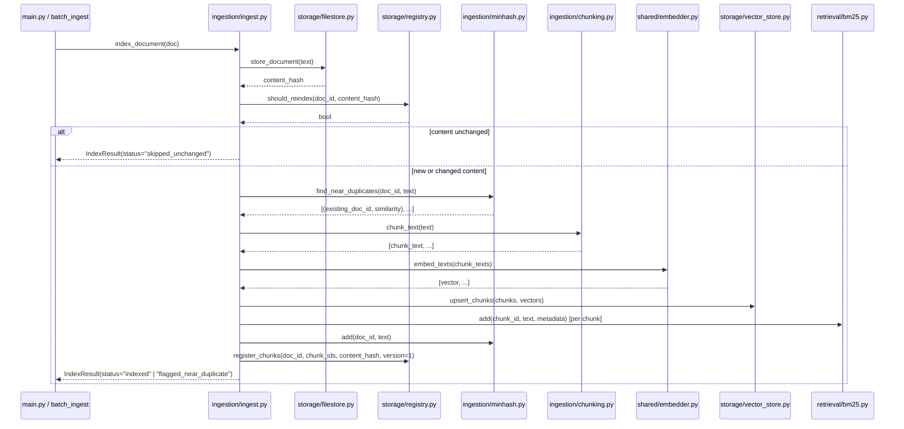
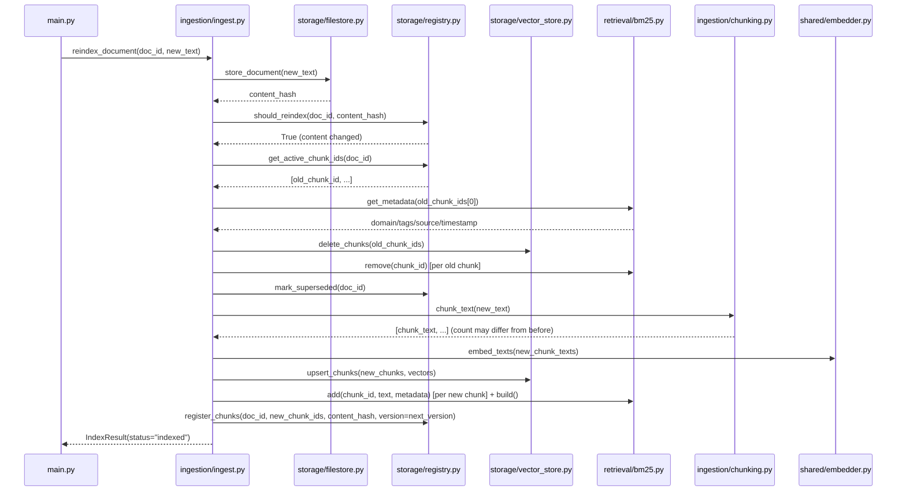
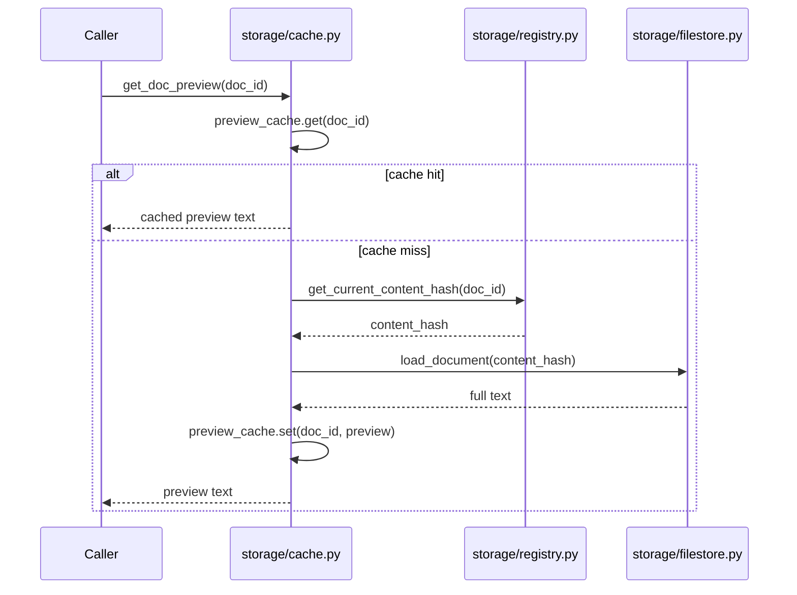
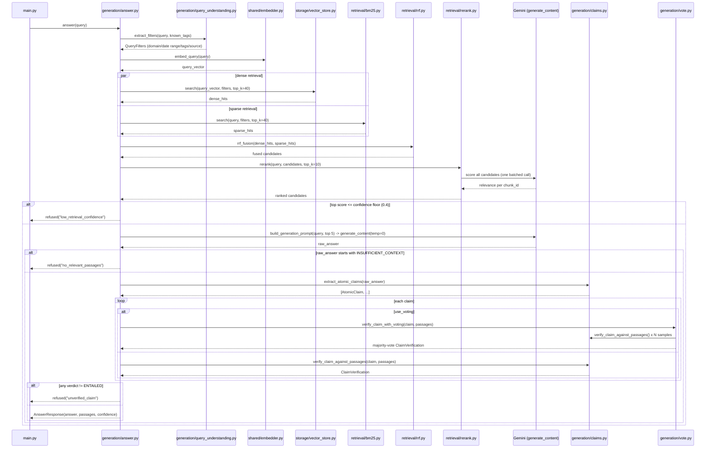

# RAGAgent — RAG Prototype

A runnable prototype of a production RAG system design goal: "RAG with 10M
docs, zero hallucinations" — hybrid retrieval, a confidence-gated refusal
path, and claim-by-claim fact-checking so the system never asserts anything
it can't trace back to a retrieved passage.

This prototype proves out the *mechanisms* (chunking, hybrid retrieval,
refusal gating, claim verification, incremental reindexing, near-dup
detection) at toy scale (a dozen hand-authored docs), not the production
*scale* (10M docs, 200-250 QPS) the design targets. See
[Known simplifications](#known-simplifications) for exactly where the two
diverge.

## Infra substitutions

No external services are installed. Each production component is swapped for
a lightweight substitute with a comparable API, so the code mirrors the real
architecture without requiring Qdrant/Postgres/Redis/S3/Elasticsearch servers:

| Production component | Substitute | Where |
|---|---|---|
| S3 | Local filesystem, content-addressable path | `storage/filestore.py` |
| PostgreSQL (doc/chunk registry) | SQLite | `storage/registry.py` |
| Redis (query/preview cache) | In-memory dict + manual TTL | `storage/cache.py` |
| Qdrant | `qdrant-client`, embedded/local mode (real API, real HNSW) | `storage/vector_store.py` |
| Elasticsearch / BM25 | Hand-rolled BM25 (`k1=1.2`, `b=0.75`) | `retrieval/bm25.py` |
| Cross-encoder reranker | One batched Gemini call | `retrieval/rerank.py` |
| NLI entailment / fact-check | LLM-as-judge verifier | `generation/claims.py` |
| AWS Lambda (realtime trigger) | Plain Python function call | `ingestion/ingest.py::reindex_document` |
| Batch API (~50% cheaper) | In-process loop | `ingestion/ingest.py::batch_ingest` |
| Distributed sharding, alias-based zero-downtime rebuild | Out of scope | — |

## Directory layout

Organized by responsibility:

```
systems/RAGAgent/
    main.py                    # runnable end-to-end demo
    corpus.py                  # synthetic 11-doc corpus + near-dup pairs
    test_failure_scenarios.py  # refusal / injection / crash-consistency checks
    README.md

    shared/                    # cross-cutting, no dependency on the other folders
        models.py              # every Pydantic schema
        embedder.py            # Gemini embeddings wrapper
        hashing.py             # content_hash, tokenize, shingles

    storage/                   # the S3 / Postgres / Redis / Qdrant substitutes
        filestore.py
        registry.py
        cache.py
        vector_store.py

    retrieval/                 # hybrid search: dense + sparse + fusion + rerank
        bm25.py
        rrf.py
        rerank.py

    ingestion/                 # the write path
        chunking.py
        minhash.py
        ingest.py              # index_document / reindex_document / batch_ingest

    generation/                # the LLM-facing half of the read path
        answer.py              # answer() -- the full orchestrator
        claims.py               # atomic claim extraction + NLI-style verification
        vote.py                 # optional majority-voting verification
        prompts.py               # every prompt builder, incl. injection defenses
        query_understanding.py   # extract_filters()

    data/                      # created at runtime: docs/, registry.db, qdrant_local/
```

Internal imports are rooted at this folder (`from storage import ...`,
`from shared.models import ...`), and there's a local `common/` copy of the
Gemini client wrapper -- this folder has no dependency on anything outside
itself, so it runs the same way whether it's part of a larger checkout or
its own standalone repo.

## Write flow — ingesting, chunking, and reindexing a document



**Reindex (update) path** — `reindex_document`, used for the ~1000 docs/day
realtime-update scenario. Same pipeline, but starts by deleting the
document's *previous* chunks from both stores before writing the new ones,
so a doc whose chunk count changes (e.g. a paragraph is added) doesn't leave
stale chunks behind:



**Doc preview (cache-through read)** — `storage/cache.py`'s `TTLCache`
substitutes for Redis, sitting in front of the filestore/registry pair that
the write flow above just populated. First lookup for a `doc_id` is a cache
miss and reads through to disk; subsequent lookups within the TTL window are
served from memory:


> Note: `get_doc_preview` is implemented and covered by the mechanism above,
> but `main.py`'s demo run doesn't currently call it — no citation-hover UI
> exists in this prototype to trigger it. See [Known simplifications](#known-simplifications).

## Query flow — `answer()`, the full read path



## Running it

```bash
pip install -r requirements.txt
cp .env.example .env    # then fill in GEMINI_API_KEY
python main.py                     # end-to-end demo: ingest, query, filter, reindex
python test_failure_scenarios.py   # refusal / injection / crash-consistency checks
```

Both scripts make real calls to the Gemini API (embeddings + generation) --
nothing is mocked. Re-running `main.py` a second time without deleting
`data/` should report `skipped_unchanged` for every doc (the content-hash
gate from `registry.should_reindex`).

## Known simplifications

Relative to both the target production design and the original
implementation plan, the following are deliberate simplifications, not bugs:

1. **Single-process, single embedded Qdrant instance** — no sharding,
   replicas, or alias-based zero-downtime rebuild.
2. **Reranker is one batched LLM call**, not a cross-encoder — latency/cost
   tradeoff noted in `retrieval/rerank.py`.
3. **No highlight-span / grounding logic** — `PassageRef` carries a score but
   not `highlight_start`/`highlight_end`; the original plan's `highlight.py`
   was never built.
4. **"Batch" ingestion is an in-process loop**, not a real Batch API job (no
   polling, no SLA, no cost discount) — see the comment in `batch_ingest`.
5. **Realtime path is a direct function call**, not a serverless (Lambda)
   trigger — `reindex_document` is the same function either way.
6. **No atomic transaction spans the Qdrant write and the registry write** —
   demonstrated, not solved, in `test_failure_scenarios.py`'s crash test.
7. **Embeddings are truncated to 768 dimensions** for toy-scale locality.
8. **BM25 and MinHash are hand-rolled** for pedagogical fidelity to their
   underlying algorithms, not a production recommendation over
   Elasticsearch/`datasketch`.
9. **Chunk overlap only applies within a single long paragraph's
   sentence-packing fallback**, not between two independent paragraph-chunks
   of the same doc — a claim spanning a pronoun/reference across two
   paragraphs (e.g. "Lincoln was president... He was a leader...") can still
   land in separate, non-overlapping chunks. Known, deliberately deferred.
10. **`enrichment.py` (LLM-driven metadata extraction) and `tracing.py`
    (OTel-style span recording) were never built** — `domain`/`tags` are
    hand-authored directly on `RawDoc` in `corpus.py` rather than inferred by
    an LLM enrichment step, and there's no per-request trace log.
11. **`get_doc_preview` (the Redis-substitute caching path) is implemented
    but not wired into `main.py`'s demo** — nothing currently calls it at
    runtime; see the write-flow diagram's note above.
12. **10M docs / 200-250 QPS / p50 1.5s / p99 5s are the production targets**
    this design is for — the 11-doc toy corpus proves the mechanisms
    (content-hash skip, near-dup flagging, RRF fusion, refusal gating,
    registry versioning) work, not that they scale.
